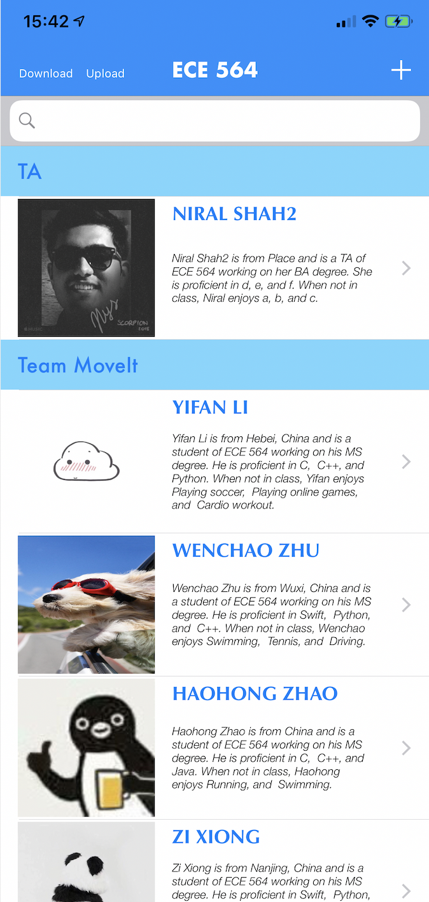

## Homework 6 - Team Consolidated App

**Team MoveIt members:**

- Haohong Zhao

- Zi Xiong

- Yifan Li

- Wenchao Zhu

##
**Notes:**
1. The App's deployment target is 12.0 and target device is iPhoneSE.
2. It is assumed that 'team' input is only applicable to students.
3. It is assumed that the professor section and TA section would not be deleted, so the functionality of swiping left to delete a cell within the professor's section or the TAs' section is disabled.
4. It is assumed that once a person was successfully added to the class, his name cannot be modified in the Information View.
5. It is assumed that the degree information has 5 default options: MS, PhD, BS, MENG, and NA. Any input of degree information downloaded from the server that does not belong to one of these 5 default options will be classified into the "other" degree.
6. Download button and Upload button are used to communicate with the server. **It might take some time to download all the information from the server**. When upload button is pressed, only the information of our team members will be uploaded.
7. There are two ways to add a new avatar: taking a new photo or selecting an existing photo from local photos library. 
   - Taking a new photo: Click the imageview at the bottom of the AddViewController or InformationViewController (there is also a default avatar image for male and female respectively), and then it will go to the default picture-taking page using the front camera of iPhone (new photos will be stored in both local disk and the photos library).
   - Selecting an existing photo: Click the 'Browse' button at the bottom of the AddViewController or InformationViewController, and then it will redirect to the Photos Library for the user to pick an image as their avatar.

##
**Main Page Screenshot:**

##
**Update History:**

Updated 10/31:

1. Updated the picture uploading/downloading functionalities.
2. Added more extensive input error checking.

Updated 10/28:

1. Added the SEARCH, ADD, DELETE and EDIT functionalities in the main table view.
2. Created a custom segue and specified consistent transition to go from Information View to a specific person's Graphic/Animation page. 
3. Nice looking table Cells, background colors, images, subtext line, pictures, and fonts.
4. Add camera/picture support that allows the user to take a picture using the front camera when adding / editing person information. 
5. Added more comments and refactored the code for better readability.

Updated 10/26:

1. Added communication support using HTTP/REST.

Updated 10/19:

1. Selected code base and created Xcode project.
2. Added UI Improvements for iPhone SE.
3. Tested all features/functions from HW1 - HW 5

